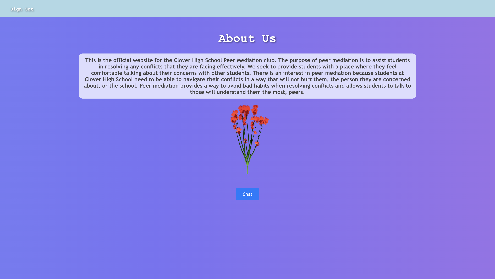
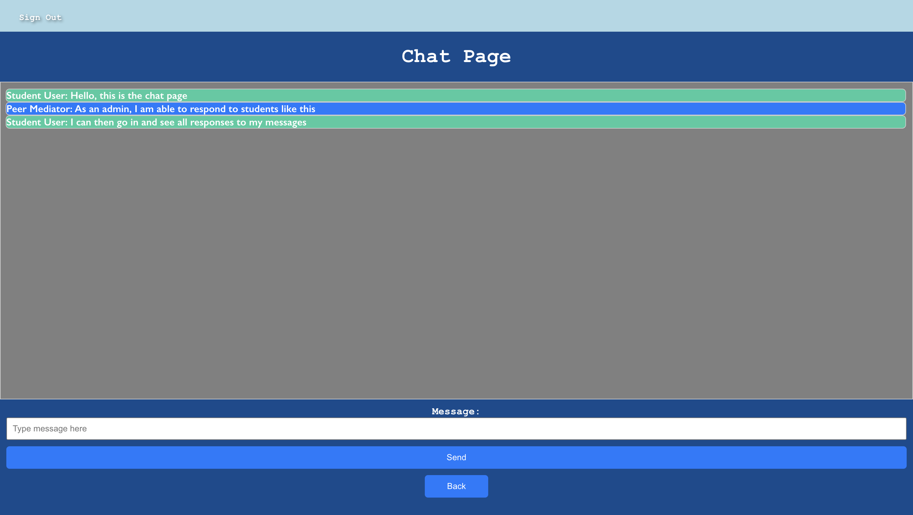

# peer-mediation-website

**Project Overview**

This is the official website for the Clover High School Peer Mediation club. It utilizes a TypeScript / React frontend with a Java Spring Boot backend. There are two ways to access the site, either as an admin (club member) or as a student user who seeks to chat with a club member. Admin access is restricted by a confidental username and password, and only students with a Clover School District email can login. Upon accessing the site, student users will be taken to an about us page where they can read about the club, and there will also be an option to chat. In this chat page, they can send anonymous messages which will be accessible with time stamps on the admin's end. All chat history is stored in Google Firestore in order to ensure that chat history will persist upon signing out. The backend is hosted through AWS Elastic Beanstalk, and the frontend is hosted through AWS S3. The link to the web page can be found here https://tinyurl.com/chs-peermediation.

**Project Structure**

The project is split into two different components, client and server. Within the server folder is the Spring Boot backend for the project. In here, there are two main sections, Controllers and Storage. The Storage folder holds the FireBaseUtilities class which handles all the Firestore Database functionality such as clearing a collection, adding to a collection, or retrieving a collection. This implements the StorageInterface so that if needed, a different class could be built implementing the same interface to enable easy extension. The FireBaseUtilities class has the service annotation, enabling simple dependency injection so that it can be utilized within the controllers. The Controllers folder simply holds the Rest Controllers for the different endpoints of this API, as well as a few utility classes for JSON conversion and origin verification. Each of these endpoints utilize CORS to prevent unintended access to the server. 

The client folder, on the other hand, houses the TypeScript / React frontend. The components package contains all of the React components for the project. This is further broken down where the auth package contains all of the React components for logging in and admin functionality. The Chat, HomePage, and AboutUs components work together, where the HomePage component is where the student user is routed after logging in, and this component serves as a component for switching between the About Us tabs and the Chat page. The Chat page enables either an admin or student user to chat, where messages from the admin are rendered as blue and student user messages are rendered as green. In order for the admin to respond to a student user, they must go through the Admin Dashboard where all chats are displayed in an email-like format. The utils components houses the api class which has functions for fetching data
from the backend, and the cookie class handles adding and removing cookies when signing in and signing
out. 

**Components Visualized**

*Login Screen*

*Admin Login*

*About Us Page*

*Chat Page*

*Admin Dashboard*

